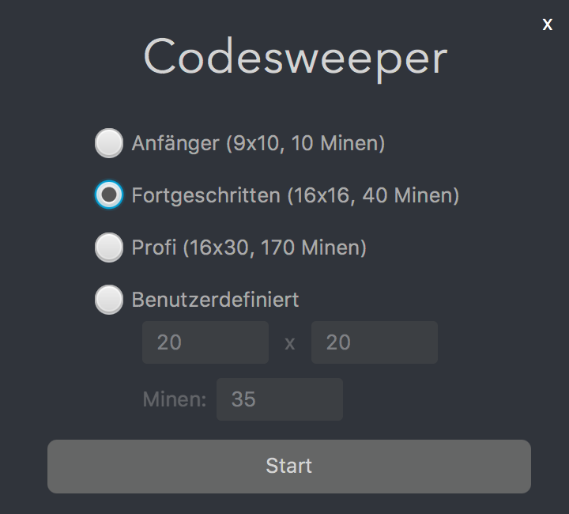
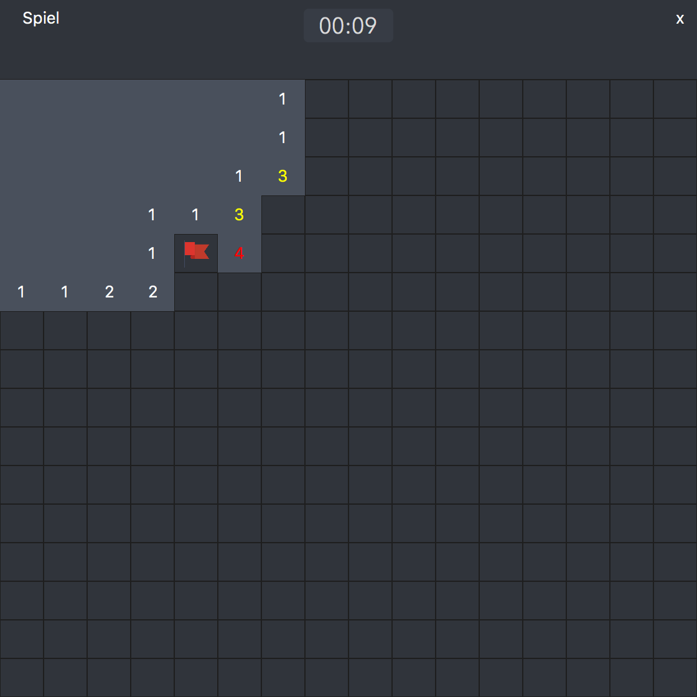
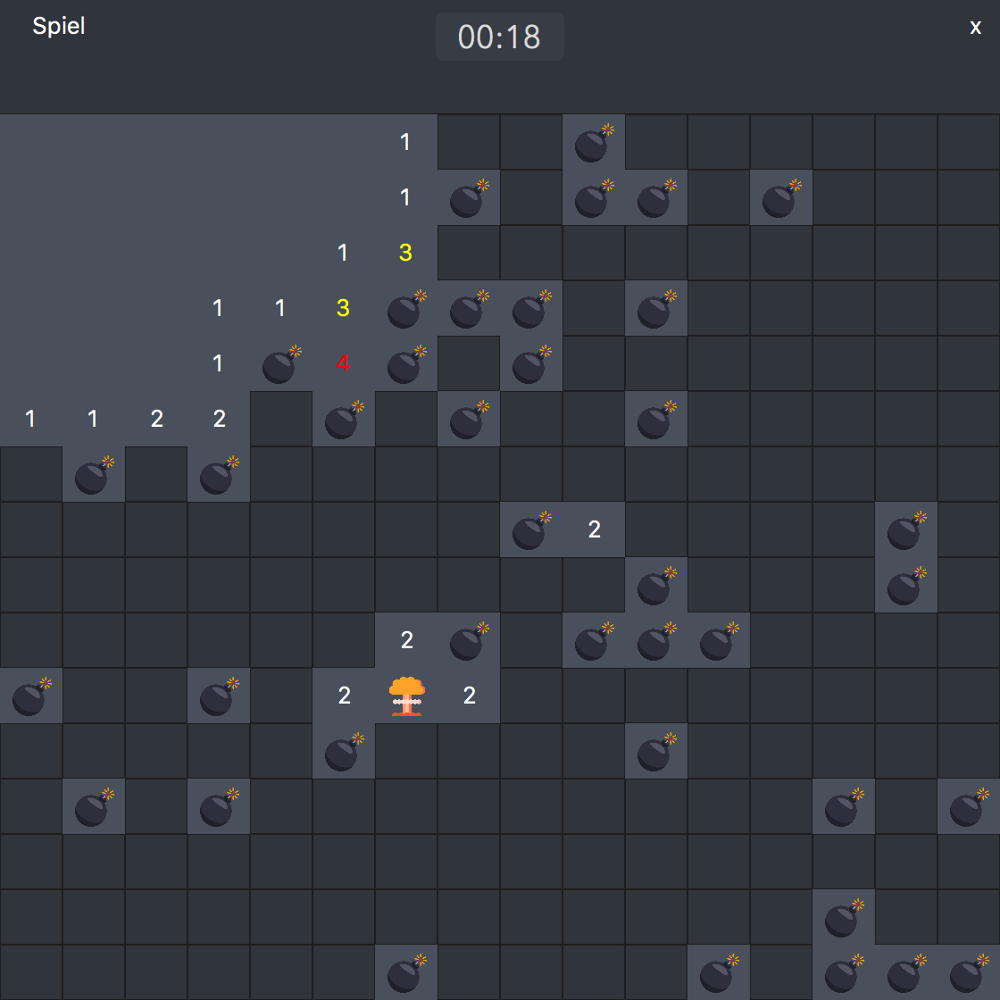

# Codesweeper
Minesweeper implementation in JavaFX for the get-in-it Code Competition.

# General
A runnable jar can be found in the <b>Runnable</b> folder.
 
The source code can be found in the <b>Code/src</b> folder.
 
Im Ordner <b>Bilder</b> befinden sich Screenshots der Anwendung.

# Installation
To achieve cross-platform support JavaFX was used for implementation. To run the game Java version 1.8 will be needed.  
The Java version can be checked over the commandline by typing "java -version".
 
 
<b>A runnable .jar-file can be found under Runnable.</b>
 
 
 

# Vorschau des Spiels
Start screen
 

 
Game
 

 

# Lizenz
Lizenzen der verwendeten Grafiken

Icons made by <a href="http://www.freepik.com" title="Freepik">Freepik</a> from <a href="https://www.flaticon.com/" title="Flaticon">www.flaticon.com</a> is licensed by <a href="http://creativecommons.org/licenses/by/3.0/" title="Creative Commons BY 3.0" target="_blank">CC 3.0 BY</a>

 

Icons made by <a href="https://www.flaticon.com/authors/smashicons" title="Smashicons">Smashicons</a> from <a href="https://www.flaticon.com/" title="Flaticon">www.flaticon.com</a> is licensed by <a href="http://creativecommons.org/licenses/by/3.0/" title="Creative Commons BY 3.0" target="_blank">CC 3.0 BY</a>

 

Icons made by <a href="https://www.flaticon.com/authors/creaticca-creative-agency" title="Creaticca Creative Agency">Creaticca Creative Agency</a> from <a href="https://www.flaticon.com/" title="Flaticon">www.flaticon.com</a> is licensed by <a href="http://creativecommons.org/licenses/by/3.0/" title="Creative Commons BY 3.0" target="_blank">CC 3.0 BY</a>

